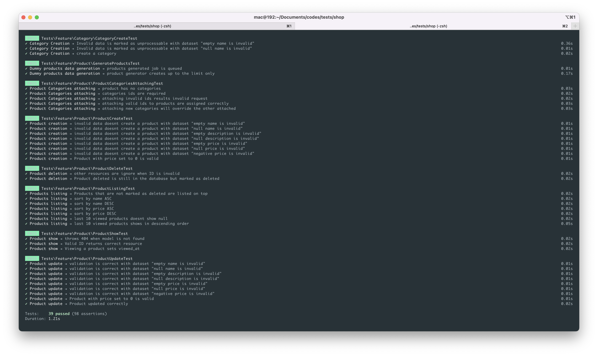

# Installation

In order to install all the project dependencies, please make sure to run `composer install`.
This project requires **PHP ^8.1**

# Tests

Tests can be executed by running the following command `php artisan test`

`.env.testing` is the environment responsible for the tests. In case you want to prepare a mysql DB for testing, that can be done from there.



# Create Category

to create a category, you need to send a **POST** request to `/api/categories` endpoint. Below are the all the inputs
informations.

| params | required | Description      |
|--------|----------|------------------|
| name   | true     | The product name |

Response example:

```json
{
    "data": {
        "id": 173,
        "name": "new category",
        "created_at": "2023-12-17 14:40:16",
        "updated_at": "2023-12-17 14:40:16"
    }
}
```

# Create Product

to create a product, you need to send a **POST** request to `/api/products` endpoint. Below are the all the inputs
informations.

| params      | required | Description             |
|-------------|----------|-------------------------|
| name        | true     | The product name        |
| description | true     | The product description |
| price       | true     | The product price       |

Response example:

```json
{
    "data": {
        "id": 173,
        "name": "new name",
        "price": 100,
        "description": "new description",
        "viewed_at": null,
        "created_at": "2023-12-17 14:40:16",
        "updated_at": "2023-12-17 14:40:16",
        "deleted_at": null
    }
}
```

# Show Product

to show a product, you need to send a **GET** request to `/api/products/{id}` endpoint.

Response example:

```json
{
    "data": {
        "id": 173,
        "name": "new name",
        "price": 100,
        "description": "new description",
        "viewed_at": null,
        "created_at": "2023-12-17 14:40:16",
        "updated_at": "2023-12-17 14:40:16",
        "deleted_at": null
    }
}
```

# Update Product

to update a product, you need to send a **PUT|PATCH** request to `/api/products/{id}` endpoint. Below are the all the
inputs
informations.

| params      | required | Description             |
|-------------|----------|-------------------------|
| name        | true     | The product name        |
| description | true     | The product description |
| price       | true     | The product price       |

Response example:

```json
{
    "data": {
        "id": 173,
        "name": "new updated name",
        "price": 1000,
        "description": "new description description",
        "viewed_at": "2023-12-17 14:42:12",
        "created_at": "2023-12-17 14:40:16",
        "updated_at": "2023-12-17 14:42:58",
        "deleted_at": null
    }
}
```

# Delete Products

to delete a product, you need to send a **DELETE** request to `/api/products/{id}` endpoint.
The response will be a `204` with no content.

# Generate Products

to generate dummy data for products, you need to send a **POST** request to `/api/products/generate` endpoint.

> [!CAUTION]
> Generating dummy data requires the queue to be up and running. You can do so by running `php artisan queue:work`

Response example:

```json
{
    "message": "10000000 products will be available in your account shortly."
}
```

# Attach Categories to Products

to attach categories to products, you need to send a **PUT** request to `api/products/{products-id}/categories/attach`
endpoint. Below are the all the inputs
informations.

| params     | required | Description                                        |
|------------|----------|----------------------------------------------------|
| categories | true     | array of categories to attach to the given product |

Response example:

```json
{
    "data": {
        "id": 173,
        "name": "new updated name",
        "price": 1000,
        "description": "new description description",
        "categories": [
            {
                "id": 17,
                "name": "new names",
                "created_at": "2023-12-17 14:48:50",
                "updated_at": "2023-12-17 14:48:50"
            }
        ],
        "viewed_at": "2023-12-17 14:42:12",
        "created_at": "2023-12-17 14:40:16",
        "updated_at": "2023-12-17 14:44:12",
        "deleted_at": "2023-12-17 14:44:12"
    }
}
```

# Listing and filtering products

to list or filter products, you need to send a **GET** request to `api/products` endpoint. Below are the all the inputs
informations. The products are sorted by top to Deleted. Deleted products will appear in the bottom.

| Query param | values       | Description                        |
|-------------|--------------|------------------------------------|
| name        | ASC / DESC   | Sorts by name                      |
| price       | ASC / DESC   | Sorts by price                     |
| last-viewed | TRUE / FALSE | returns 10 latests viewed products |

Response example without `last-viewed` param:

```json
{
    "data": [
        {
            "id": 173,
            "name": "new name",
            "price": 100,
            "description": null,
            "categories": [],
            "viewed_at": null,
            "created_at": null,
            "updated_at": null,
            "deleted_at": "2023-12-17 15:07:50"
        },
        {
            "id": 175,
            "name": "new name",
            "price": 100,
            "description": null,
            "categories": [],
            "viewed_at": null,
            "created_at": null,
            "updated_at": null,
            "deleted_at": "2023-12-17 15:07:59"
        }
    ],
    "links": {
        "first": null,
        "last": null,
        "prev": null,
        "next": null
    },
    "meta": {
        "path": "https://shop.test/api/products",
        "per_page": 100,
        "next_cursor": null,
        "prev_cursor": null
    }
}
```

Response example with `last-viewed` param.

```json
{
    "data": [
        {
            "id": 173,
            "name": "new name",
            "price": 100,
            "description": null,
            "categories": [],
            "viewed_at": "2023-12-17 15:08:50",
            "created_at": null,
            "updated_at": null,
            "deleted_at": "2023-12-17 15:07:50"
        },
        {
            "id": 175,
            "name": "new name",
            "price": 100,
            "description": null,
            "categories": [],
            "viewed_at": "2023-12-17 15:07:50",
            "created_at": null,
            "updated_at": null,
            "deleted_at": "2023-12-17 15:07:59"
        }
    ]
}
```

## POSTMAN collection

You can import the following [collection](doc/tinyurl_postman_collection.json) to postman to have everything ready.

> [!CAUTION]
> Do not forget to change environment host variable

# What could be done better

Definitely the frontend design and UI if there was more time. 
I tried to reflect a quality backend concentrated work.

# Final word

Thank you for giving me the chance to apply to this position.
